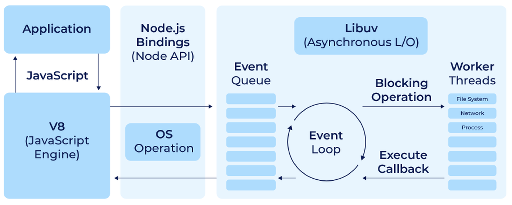

# Node.js Made Easy

This is a comprehensive and up-to-date Node.js tutorial documentation for JavaScript back-end developers

## Getting Started

[Home](../README.md) / [How web works](./how-web-works.md) / What is node? / [First Node program](./first-node-program.md)


### What is node

Node JS is a free, open-source and cross-platform runtime enviroment for executing JavaScript code outside of the web browser i.e on the server.

`NOTE` : Node is neither a language or a web framework, it just a runtime enviroment for executing JavaScript code.

### Node Architecture and how it work

- Node is the runtime enviroment build on top Google V8 JavaScript engine embedded inside a C++ program that can execute our JavaScript code.
- In addition, Node ships some additional modules that gives capabilities not available inside a browser.

  For example...

  ```js
  // work with file system
  const fs = require("fs");
  fs.readFile();

  // listen for network request at given port
  const http = require("http");
  http.createServer((req, res) => {
    // Do somthing...
  });
  ```

#### Here is how Node.js handles a file request

- Node has the non-blocking (asynchronous) nature by default. This means a single thread is allocated to handle multiple requests.
- Node.js eliminates the waiting, and simply continues with the next request.



- When Node server received a request, a single thread is allocated to handle that request. As part of handling that request, its likely we're going to query a database.
- A given thread will continue serving another client-request while waiting for database to execute the query.
- When database prepared the results, it puts the message in a so called event queue.
- Node is continously monitoring this queue in a background, when it find an event in this queue, it will take it out and process it

### Why use Node

- Node is easy to get started and can be used for prototyping and agile development
- Node is used to build superfast and highly-scalable services.
- Node has large ecosystem of open-source libraries

### When to and not to use Node

- Node is ideal for building highly-scalable, data-intensive and real-time back-end services (API) that power our client-applications (mobile and/or web apps).

- Node should be used to build I/O-intensive applications that include a lots of network access. We can serve many clients without a need to through in more hardware

- Since Node is a single thread in nature, it should not be used for CPU-intensive applications such as video encoding or image manipulation services as they involve lot of calculations to be done by CPU.
